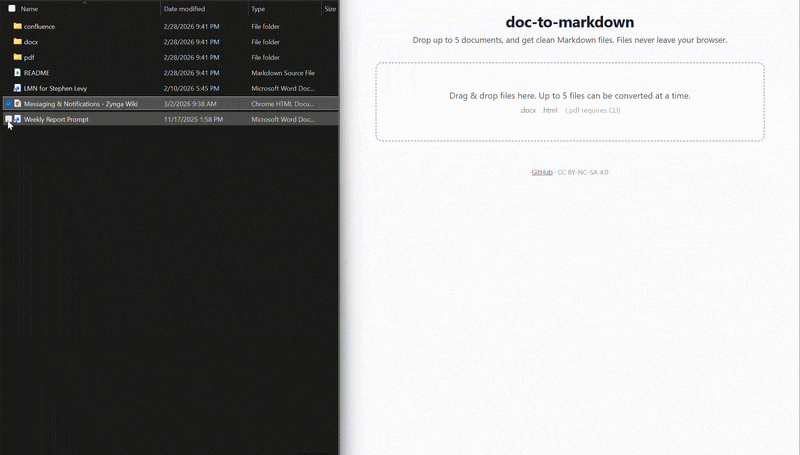

```
┌─────────────────────────────────────────────┐
│           doc-to-markdown                   │
│                                             │
│   v0.3.0  •  Mar 4 2026                     │
│   MIT License                               │
└─────────────────────────────────────────────┘
```

## 📣 What This Is

If you're a PM, you already know the pain. Your best thinking lives in Google Docs, Word files, PDFs, and Confluence pages — but the moment you need that content somewhere else, you're stuck.

Maybe you're feeding documents to an AI agent and the formatting comes out garbled. Maybe you're publishing a spec to GitHub and spending 30 minutes hand-fixing bullet lists. Maybe you're migrating a wiki and every table breaks.

**doc-to-markdown** solves this. It's a set of AI conversion skills and a lightweight Python CLI that turn messy source documents into clean, well-structured Markdown. No fluff, no heavy dependencies, no manual cleanup.



## 🎯 Three Use Cases

- **AI-Ready Formatting** — Convert docs into clean Markdown that AI agents can parse reliably. No smart quotes, no phantom formatting, no broken structure to confuse your prompts.
- **GitHub Publishing** — Turn a Google Doc spec or Word PRD into a Markdown file that renders beautifully on GitHub. Headings, tables, lists — all clean on the first pass.
- **Knowledge Base Migration** — Moving from Confluence or a shared drive to a Markdown-based knowledge base? Batch-convert your docs and skip the manual cleanup.

## 📋 Format Support Matrix

| Format | Source | CLI | Web UI |
|--------|--------|-----|--------|
| Google Docs | Export to `.docx` | ✅ | ✅ |
| Word `.docx` | Direct | ✅ | ✅ |
| PDF | Direct | ✅ | -- |
| Confluence | HTML export | ✅ | ✅ |

## 🌐 Web UI

**[Try it in your browser](https://stlevy53.github.io/doc-to-markdown/)** — drag and drop up to 5 `.docx` or `.html` files and get clean Markdown instantly. No install required. Files never leave your machine (runs entirely client-side via Pyodide). PDF conversion requires the CLI.

## 🚀 Quick Start

Clone and install dependencies:

```bash
git clone https://github.com/stlevy53/doc-to-markdown.git
cd doc-to-markdown
pip install -r requirements.txt
```

Convert a document:

```bash
python scripts/convert.py input.docx -o output.md
```

Convert a PDF:

```bash
python scripts/convert.py report.pdf -o report.md
```

Convert a Confluence HTML export:

```bash
python scripts/convert.py exported-page.html --format confluence -o page.md
```

## 🧠 AI Skills

The `skills/` directory contains standalone conversion guides that AI agents can load to perform or improve document-to-Markdown conversion. Each skill is a self-contained reference — no code required.

| Skill File | Description |
|------------|-------------|
| `conversion-rules.md` | Baseline rules for clean Markdown output — apply this to every conversion |
| `docx-conversion.md` | Format-specific guidance for Word `.docx` files |
| `pdf-conversion.md` | Handling PDF quirks: column layouts, embedded tables, OCR artifacts |
| `confluence-conversion.md` | Cleaning up Confluence HTML exports: macros, panels, page trees |
| `table-handling.md` | Deep dive on converting complex tables to Markdown or structured alternatives |
| `quality-checklist.md` | Post-conversion quality checks to run before calling it done |

## 🏗️ Philosophy

This project has opinions:

- **Zero fluff.** Every skill and every line of CLI code earns its place. If it doesn't help a real conversion, it doesn't ship.
- **Agent-ready.** Skills are written so an AI agent can load them and immediately produce better output. No interpretation required.
- **Practical over perfect.** A 90% conversion you can ship today beats a 100% conversion you'll never finish. Handle the common cases well; flag the edge cases clearly.
- **Three deps only.** The CLI keeps its dependency footprint tiny. Heavy frameworks need not apply.

## 📄 License

This project is licensed under the [MIT License](LICENSE).
